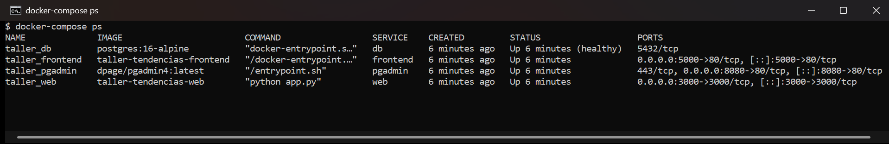
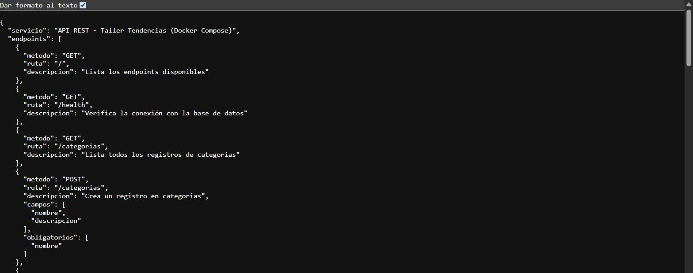
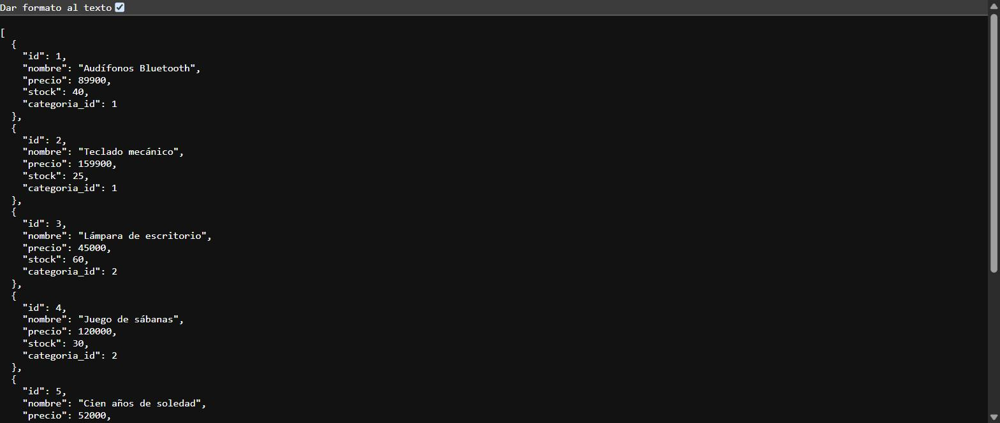
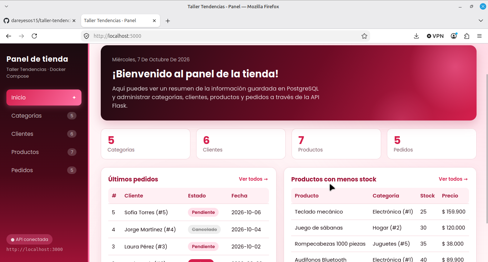
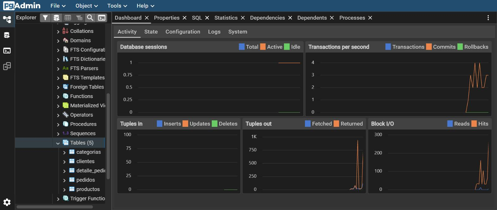

# Taller Tendencias: orquestación de servicios con Docker Compose

Stack de cuatro servicios orquestados con `docker-compose`, que se comunican por una red interna de Docker:

| Servicio | Contenedor | Imagen / build | Puerto en el host | Función |
|---|---|---|---|---|
| `db` | `taller_db` | `postgres:16-alpine` | ninguno (solo red interna) | Base de datos con los datos en un volumen nombrado |
| `web` | `taller_web` | build `./app` (Python 3.12 + Flask) | `3000` | API REST con CRUD sobre la base de datos |
| `pgadmin` | `taller_pgadmin` | `dpage/pgadmin4` | `8080` | Panel de administración de PostgreSQL |
| `frontend` | `taller_frontend` | build `./frontend` (Nginx) | `5000` | Página HTML/JS que consume la API |

## Arquitectura

```
                    red interna: taller-network
               ┌─────────────────────────────────────────────┐
 Navegador ──► │  frontend (Nginx)      :5000                │
     │         │                                             │
     │ fetch() │                                             │
     ├───────► │  web (Flask)           :3000 ───┐           │
     │         │                                 ▼           │
     │         │                          db (PostgreSQL)    │──► volumen taller_pgdata
     │         │                          5432 sin publicar  │
     │         │                                 ▲           │
     └───────► │  pgadmin               :8080 ───┘           │
               └─────────────────────────────────────────────┘
```

- PostgreSQL **no publica puertos** al host: solo `web` y `pgadmin` lo alcanzan por la red `taller-network`, usando el nombre de servicio `db`.
- `db` tiene un *healthcheck* (`pg_isready` sobre la base de datos configurada). `web` y `pgadmin` usan `depends_on` con `condition: service_healthy`, así que arrancan solo cuando la base ya acepta conexiones. La API no tiene esperas activas.
- Los datos de PostgreSQL viven en el volumen nombrado `taller_pgdata` y la configuración de pgAdmin en `taller_pgadmin_data`.

## Requisitos

- Docker con Docker Compose v2 (Docker Desktop, o Docker Engine con el plugin `docker-compose-plugin`).
- Los puertos `3000`, `5000` y `8080` libres en el equipo.

## Estructura del proyecto

```
.
├── docker-compose.yml        # Orquestación de los 4 servicios, red y volúmenes
├── .env                      # Variables de entorno (credenciales); no se sube al repositorio
├── .env.example              # Plantilla de .env
├── app/
│   ├── Dockerfile            # Imagen del servicio Flask
│   ├── app.py                # API REST
│   ├── requirements.txt      # Dependencias de Python
│   └── init-db/
│       └── 01-init.sql       # Tablas y datos de ejemplo (se ejecuta al crear la BD)
├── frontend/
│   ├── Dockerfile            # Imagen de Nginx con el frontend
│   └── index.html            # Interfaz de usuario
├── pgadmin/
│   └── servers.json          # Registra el servidor "db" en pgAdmin automáticamente
├── docs/capturas/            # Capturas de pantalla de este README
└── README.md
```

## Configuración (`.env`)

Todas las credenciales están en `.env`, nunca en `docker-compose.yml` ni en el código. El archivo está en `.gitignore`; si no existe, se crea a partir de la plantilla y se cambian las contraseñas:

```bash
cp .env.example .env
```

| Variable | Uso |
|---|---|
| `POSTGRES_DB` | Nombre de la base de datos. PostgreSQL la crea al iniciar, por eso el script SQL no la crea. |
| `POSTGRES_USER` / `POSTGRES_PASSWORD` | Usuario y contraseña de PostgreSQL. La API los recibe como `DB_USER` / `DB_PASSWORD`. |
| `DB_HOST` / `DB_PORT` | Dónde encuentra la API a PostgreSQL dentro de la red: `db` y `5432`. |
| `PGADMIN_DEFAULT_EMAIL` / `PGADMIN_DEFAULT_PASSWORD` | Cuenta inicial que exige la imagen de pgAdmin. Con la configuración actual (modo escritorio) pgAdmin no pide iniciar sesión. |

## Puesta en marcha

```bash
docker-compose up --build
```

Ese único comando descarga las imágenes, construye `web` y `frontend`, crea la red y los volúmenes, inicializa la base de datos con `app/init-db/01-init.sql` y levanta los cuatro servicios. La primera vez tarda más, porque descarga las imágenes; después levanta en pocos segundos.

| Servicio | URL |
|---|---|
| Frontend | http://localhost:5000 |
| API | http://localhost:3000 |
| pgAdmin | http://localhost:8080 |

> **pgAdmin tarda unos 30 segundos** en abrir la primera vez que arranca (prepara su configuración interna) y unos 12 segundos en los arranques siguientes. Si `localhost:8080` no carga de inmediato, hay que esperar un momento y recargar.

### Comandos útiles

```bash
docker-compose ps                 # estado de los servicios
docker-compose logs -f web        # logs de un servicio
docker-compose down               # detener sin borrar los datos
docker-compose down -v            # detener y borrar los volúmenes (datos)
docker-compose up --build         # volver a construir y levantar
```

Para reiniciar desde cero (vuelven los datos de ejemplo):

```bash
docker-compose down -v
docker-compose up --build
```

## Base de datos

`app/init-db/01-init.sql` se monta en `/docker-entrypoint-initdb.d` y PostgreSQL lo ejecuta automáticamente **solo la primera vez**, cuando el volumen está vacío. Crea cinco tablas relacionadas con claves foráneas y carga datos de ejemplo:

| Tabla | Registros de ejemplo | Relación |
|---|---|---|
| `categorias` | 5 | |
| `clientes` | 6 | |
| `productos` | 7 | `categoria_id` → `categorias` |
| `pedidos` | 5 | `cliente_id` → `clientes` |
| `detalle_pedido` | 8 | `pedido_id` → `pedidos`, `producto_id` → `productos` |

Los datos se conservan entre `docker-compose down` y `docker-compose up` porque están en el volumen `taller_pgdata`. Solo `docker-compose down -v` los borra.

## API REST (Flask)

Base: `http://localhost:3000`. Todas las respuestas, incluidos los errores, son JSON, y CORS está habilitado para que el frontend pueda consumirla.

| Método | Ruta | Descripción |
|---|---|---|
| GET | `/` | Lista todos los endpoints disponibles |
| GET | `/health` | Verifica la conexión con la base de datos |
| GET | `/{recurso}` | Lista todos los registros |
| GET | `/{recurso}/{id}` | Obtiene un registro |
| POST | `/{recurso}` | Crea un registro (responde `201`) |
| PUT o PATCH | `/{recurso}/{id}` | Actualiza los campos enviados |
| DELETE | `/{recurso}/{id}` | Elimina un registro |

Recursos disponibles y sus campos (los obligatorios al crear van en **negrita**):

| Recurso | Campos |
|---|---|
| `categorias` | **`nombre`**, `descripcion` |
| `clientes` | **`nombre`**, **`email`**, `ciudad` |
| `productos` | **`nombre`**, **`precio`**, **`categoria_id`**, `stock` |
| `pedidos` | **`cliente_id`**, `estado` (`pendiente`, `enviado`, `entregado` o `cancelado`) |

### Ejemplos con curl

```bash
# Listar productos
curl http://localhost:3000/productos

# Crear una categoría
curl -X POST http://localhost:3000/categorias \
     -H "Content-Type: application/json" \
     -d '{"nombre": "Mascotas", "descripcion": "Productos para mascotas"}'

# Actualizar el precio del producto 1
curl -X PUT http://localhost:3000/productos/1 \
     -H "Content-Type: application/json" \
     -d '{"precio": 79900}'

# Eliminar el cliente 6
curl -X DELETE http://localhost:3000/clientes/6
```

En PowerShell de Windows hay que usar `curl.exe` en lugar de `curl`.

### Códigos de respuesta

| Código | Cuándo |
|---|---|
| `200` / `201` | Operación correcta / registro creado |
| `400` | Falta un campo obligatorio, el cuerpo no es JSON o un valor no es válido (por ejemplo, precio negativo o estado inexistente) |
| `404` | El registro o la ruta no existe |
| `405` | Método no permitido en esa ruta |
| `409` | Valor único repetido (email de cliente) o conflicto de relación (por ejemplo, borrar una categoría que tiene productos) |
| `503` | La base de datos no está disponible en ese momento |

## pgAdmin

1. Abrir http://localhost:8080. No pide inicio de sesión.
2. El servidor **taller_db** ya aparece registrado en *Servers* (lo carga `pgadmin/servers.json`).
3. Al expandirlo, pgAdmin pide la contraseña: es el valor de `POSTGRES_PASSWORD` en `.env`.
4. Las tablas están en *Databases → taller_db → Schemas → public → Tables*.

## Capturas de pantalla

### 1. `docker-compose ps` con todos los servicios en ejecución

`db` aparece como *healthy* y no publica puertos al host; `web`, `frontend` y `pgadmin` publican 3000, 5000 y 8080.



### 2. API respondiendo desde el navegador

`GET http://localhost:3000/` con la lista de endpoints:



`GET http://localhost:3000/productos` con los datos cargados por el script SQL:



### 3. Frontend funcionando en el navegador

`http://localhost:5000` servido por Nginx. La página consume los endpoints `/categorias`, `/clientes`, `/productos` y `/pedidos` con `fetch()`, muestra los registros en tablas y permite crear, editar y eliminar desde un formulario lateral.



### 4. pgAdmin conectado mostrando las tablas



## Solución de problemas

- **"port is already allocated" o "address already in use"**: otro programa usa el puerto 3000, 5000 u 8080. En macOS, el puerto 5000 suele estar ocupado por *Receptor AirPlay* (Ajustes del Sistema → General → AirDrop y Handoff).
- **Cambios en `01-init.sql` que no se aplican**: el script solo corre con el volumen vacío. Hay que ejecutar `docker-compose down -v` y luego `docker-compose up --build`.
- **La API responde `503`**: la base de datos se está reiniciando; la API se reconecta sola en cuanto vuelve a estar disponible.
